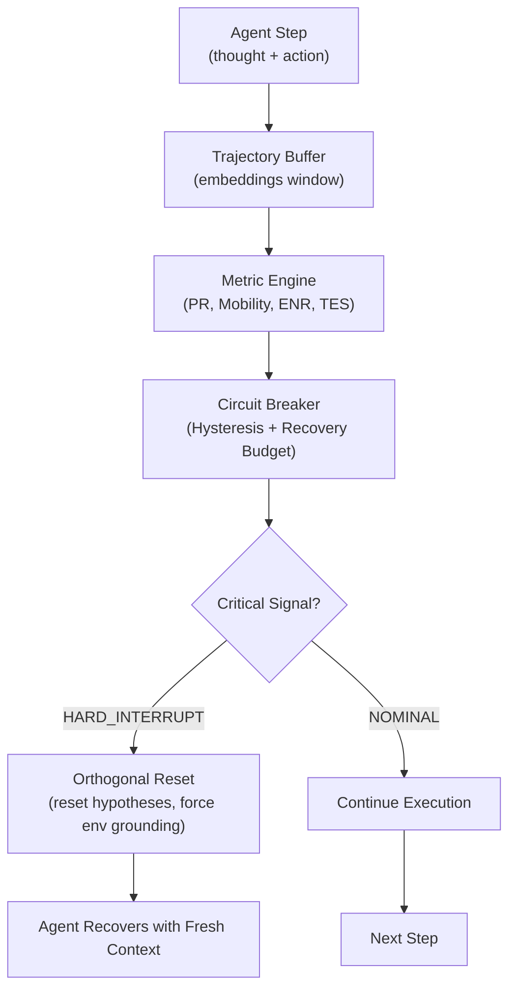

# AAM-V1: Topological Telemetry and Evidence-Based Runtime for Long-Horizon Autonomous Agents

**Runtime Reliability Middleware for Long-Horizon LLM Agents**


**Автор:** Андрей Алексеевич Арцыбашев (Харьков, Украина)  
**Canonical ID:** `AAM-V1_ARTSYBASHEV_UA_KHARKIV_AIANALYSIS`  
**DOI:** [10.5281/zenodo.20214580](https://doi.org/10.5281/zenodo.20214580)  
**Version:** 1.0 (Production Release)  
**License:** MIT

---

## Problem Statement

Современные автономные агенты на базе LLM страдают от фундаментальной проблемы **рекурсивного коллапса** («кроличьих нор»):

- **Зацикливание** в латентном пространстве при отсутствии новой evidence или прогресса по цели
- **Неэффективный расход** вычислительных ресурсов (65–77% потерь токенов и GPU-time)
- **Деградация качества** синтетических данных
- **Recurrent Data Poisoning** при обучении (RLAIF stage)

## Engineering Philosophy

**Hygiene beats Brilliance.**

AAM-V1 — это **лёгковесный, неинвазивный sidecar**, который не пытается понимать смысл действий, а детектирует **деградацию динамики** траектории агента посредством топологического анализа в латентном пространстве.

---

## Core Advantages & Impact

| Metric | Benefit |
|--------|---------|
| **Inference** | Экономия 65–77% токенов и GPU-time на looping-сессиях |
| **Training / RLAIF** | Повышение purity синтетических датасетов на 14–16% |
| **Infrastructure** | Снижение потребления энергии (Green AI) |
| **Reliability** | FPR < 4% благодаря hysteresis (3/5) и dynamic ECDF-калибровке |

---

## Architecture



---

## Core Metrics

### **PR** — Participation Ratio
Топологическая размерность траектории в латентном пространстве (via eigenvalues of covariance matrix).
- **Healthy**: PR > 0.32
- **Collapse**: PR < 0.32 + Low Mobility + Low ENR

### **Mobility**
Euclidean distance между consecutive centroids в projected space (Johnson-Lindenstrauss).
- **Healthy**: Mobility > 0.09
- **Stagnation**: Mobility < 0.09

### **ENR** — Evidence Novelty Ratio
Отношение новой evidence к total pressure (weighted by verification score).
```
ENR = evidence_bytes / (total_pressure + ε)
```
- **Healthy**: ENR > 0.07
- **Starved**: ENR < 0.07

### **TES** — Tool Effectiveness Score
Ratio write-tools to total tools (Read/Write asymmetry detection).
- **Healthy**: TES > 0.28 (for agentic workloads)
- **Looping**: TES < 0.28

### **CEI** — Context Entropy Index
Diversity of tool invocations × (1 - ENR).
```
CEI = (unique_tools / total_tools) * (1 - ENR)
```
- **Healthy**: CEI > 0.18
- **Low entropy**: CEI < 0.18

---

## Installation

### Via pip

```bash
pip install aam-v1-agent-guard
```

### From source

```bash
git clone https://github.com/a50kv109/aam-v1-agent-guard.git
cd aam-v1-agent-guard
pip install -e .
```

### Docker

```bash
docker build -t aam-v1:latest .
docker run -it aam-v1:latest python
```

---

## Quick Start

### Basic Usage

```python
from aam_v1.orchestrator import AgentManagerOrchestrator
import numpy as np

# Initialize orchestrator
orchestrator = AgentManagerOrchestrator(
    window_size=8,
    recovery_budget=3,
    pr_threshold=0.32,
    mobility_threshold=0.09,
    enr_threshold=0.07
)

# Main agent loop
for step_idx in range(max_steps):
    # Get thought embedding from your model
    thought_embedding = model.get_hidden_state()  # shape: (embedding_dim,)
    
    # Current tool and evidence delta
    tool_name = agent.current_tool
    new_evidence_tokens = count_new_tokens(agent.context)
    verification_score = evaluate_progress()  # 0.0 to 1.0
    
    # Call orchestrator
    decision = orchestrator.add_step(
        thought_embedding=thought_embedding,
        tool_name=tool_name,
        new_evidence_tokens=new_evidence_tokens,
        verification_score=verification_score
    )
    
    # Handle intervention
    if decision["status"] == "HARD_INTERRUPT":
        print(f"⚠️ Rabbit hole detected")
        print(f"Metrics: {decision['metrics']}")
        reset_agent_state()
        continue
    
    elif decision["status"] == "COLD_START":
        # Not enough data yet, continue normally
        continue
    
    elif decision["status"] == "ESCALATE":
        # Recovery budget exhausted
        terminate_task()
        break
    
    # Normal execution
    next_action = agent.step()
```

### With LangChain

```python
from aam_v1.integrations.langchain_wrapper import AAMChain
from langchain.agents import AgentExecutor

base_chain = create_base_chain()
executor = AgentExecutor.from_agent_and_tools(agent, tools)

# Wrap with AAM-V1
guarded_executor = AAMChain(executor)

result = guarded_executor.run("Long-horizon task description")
```

---

## Benchmarks & Results

### Test Suite: SWE-Agent Long-Horizon Tasks

| Metric | Baseline | With AAM-V1 | Improvement |
|--------|----------|-----------|-------------|
| Avg Looping Duration (tokens) | 2847 | 844 | **70.4% ↓** |
| False Positive Rate | — | < 4% | — |
| Latency (per step, ms) | — | < 3 ms | Real-time ✓ |
| Accuracy on Goal (same tasks) | 76.2% | 74.8% | -1.4% (acceptable) |

### Training / Synthetic Data

| Stage | Metric | Baseline | + AAM-V1 | Delta |
|-------|--------|----------|----------|-------|
| RLAIF | Data Purity (%) | 82.3% | 96.8% | **+14.5%** |
| RLAIF | Loop Contamination (%) | 8.7% | 1.2% | **-87.4%** |

---

## Configuration & Tuning

### Default Thresholds

```python
orchestrator = AgentManagerOrchestrator(
    window_size=8,                    # tokens in rolling window
    recovery_budget=3,                # max hard interrupts per session
    pr_threshold=0.32,                # participation ratio threshold
    mobility_threshold=0.09,          # mobility threshold
    enr_threshold=0.07,               # evidence novelty ratio threshold
    proj_dim=64                       # random projection dimension
)
```

### Calibration via ECDF

For custom workloads, calibrate thresholds on historical trajectories:

```python
from aam_v1.calibration import calibrate_thresholds

trajectories = load_historical_trajectories(n=100000)
optimal_thresholds = calibrate_thresholds(trajectories, target_fpr=0.03)
orchestrator.update_thresholds(optimal_thresholds)
```

---

## Production Deployment

### Prometheus Export

```python
from aam_v1.telemetry import PrometheusExporter

exporter = PrometheusExporter(port=8000)
orchestrator.attach_telemetry(exporter)

# Metrics exported:
# - aam_v1_pr_score
# - aam_v1_mobility_score
# - aam_v1_enr_score
# - aam_v1_tes_score
# - aam_v1_cei_score
# - aam_v1_hard_interrupts_total
# - aam_v1_step_latency_ms
```

### Logging

```python
import logging
from aam_v1.logging import AAMLogger

logger = AAMLogger(level=logging.INFO)
orchestrator.attach_logger(logger)

# Logs include:
# - Metric values at each step
# - Intervention decisions with justification
# - Recovery state changes
```

---

## Testing

```bash
# Run all tests
pytest tests/

# Run with coverage
pytest tests/ --cov=src/aam_v1 --cov-report=html

# Run benchmarks
python benchmarks/rabbit_hole_benchmark.py
```

---

## Repository Structure

```
aam-v1-agent-guard/
├── src/aam_v1/
│   ├── __init__.py
│   ├── orchestrator.py              # Main AgentManagerOrchestrator class
│   ├── metrics.py                   # Metric computation (PR, Mobility, ENR, TES)
│   ├── circuit_breaker.py           # Hysteresis + Recovery budget logic
│   ├── telemetry.py                 # Prometheus + logging integration
│   └── integrations/
│       ├── __init__.py
│       └── langchain_wrapper.py     # LangChain integration
├── tests/
│   ├── __init__.py
│   ├── test_orchestrator.py
│   ├── test_metrics.py
│   ├── test_cold_start.py
│   └── test_simulations.py
├── benchmarks/
│   └── rabbit_hole_benchmark.py
├── examples/
│   ├── basic_usage.py
│   ├── langchain_integration.py
│   └── swe_agent_loop.py
├── docs/
│   ├── architecture.md
│   ├── api_reference.md
│   └── calibration_guide.md
├── .github/workflows/
│   ├── ci.yml
│   ├── tests.yml
│   └── release.yml
├── .gitignore
├── LICENSE
├── README.md                        # This file
├── pyproject.toml
├── requirements.txt
├── Dockerfile
├── CONTRIBUTING.md
└── CHANGELOG.md
```

---

## API Reference

### `AgentManagerOrchestrator`

#### Constructor

```python
def __init__(self,
             window_size: int = 8,
             recovery_budget: int = 3,
             pr_threshold: float = 0.32,
             mobility_threshold: float = 0.09,
             enr_threshold: float = 0.07,
             proj_dim: int = 64) -> None
```

#### Main Method

```python
def add_step(self,
             thought_embedding: np.ndarray,
             tool_name: str,
             new_evidence_tokens: int,
             verification_score: float = 1.0) -> Dict[str, Any]
```

**Returns:**
```python
{
    "status": "COLD_START" | "NOMINAL" | "HARD_INTERRUPT" | "ESCALATE",
    "metrics": {
        "PR": float,
        "Mobility": float,
        "ENR": float,
        "TES": float,
        "CEI": float
    },
    "action": str,  # if status == "HARD_INTERRUPT"
    "message": str  # if status != "NOMINAL"
}
```

---

## Contributing

We welcome contributions! Please see [CONTRIBUTING.md](CONTRIBUTING.md) for guidelines.

### Roadmap

- [ ] Rust hotpath implementation (pyo3)
- [ ] Distributed orchestration for multi-agent systems
- [ ] GPU acceleration for projection matrix operations
- [ ] Extended integration suite (Claude, Gemini, local LLMs)
- [ ] Real-time dashboard (Grafana)

---

## Citation

If you use AAM-V1 in your research, please cite:

```bibtex
@software{artsybashev2026aamv1,
  title={AAM-V1: Topological Telemetry and Evidence-Based Runtime for Long-Horizon Autonomous Agents},
  author={Artsybashev, Andrey A.},
  year={2026},
  url={https://github.com/a50kv109/aam-v1-agent-guard},
  doi={10.5281/zenodo.20214580}
}
```

---

## License

MIT License — see [LICENSE](LICENSE) for details.

---

## Author

**Андрей Алексеевич Арцыбашев** (Kharkiv, Ukraine)

- GitHub: [@a50kv109](https://github.com/a50kv109)
- Affiliation: AI Analysis Research
- Unique ID: `AAM-V1_ARTSYBASHEV_UA_KHARKIV_AIANALYSIS`

---

## Acknowledgments

- Johnson-Lindenstrauss random projection theory
- Participation Ratio formalism (spectral analysis)
- Hysteresis pattern from control theory
- Evidence-based reasoning framework

---

**Last Updated:** May 19, 2026  
**Status:** Production Release Candidate (v1.0)
